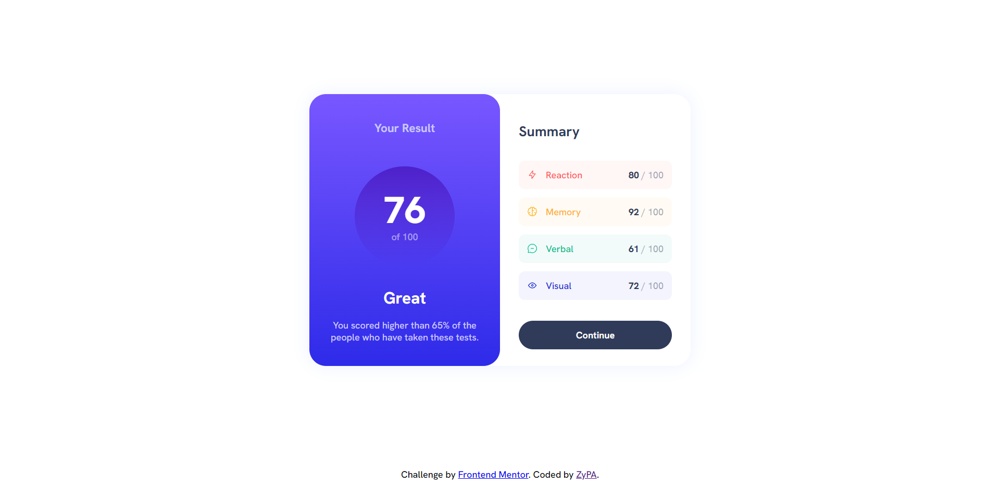

# Frontend Mentor - Results summary component solution

This is a solution to the [Results summary component challenge on Frontend Mentor](https://www.frontendmentor.io/challenges/results-summary-component-CE_K6s0maV). Frontend Mentor challenges help you improve your coding skills by building realistic projects.

## Table of contents

-   [Overview](#overview)
    -   [The challenge](#the-challenge)
    -   [Screenshot](#screenshot)
    -   [Links](#links)
-   [My process](#my-process)
    -   [Built with](#built-with)
    -   [What I learned](#what-i-learned)
-   [Author](#author)

## Overview

### The challenge

Users should be able to:

-   View the optimal layout for the interface depending on their device's screen size
-   See hover and focus states for all interactive elements on the page
-   **Bonus**: Use the local JSON data to dynamically populate the content

### Screenshot



### Links

-   Solution URL: [GitHub Repo](https://github.com/ZyPA/Frontend-Mentor-Results-summary-component-solution)
-   Live Site URL: [GitHub Pages](https://zypa.github.io/Frontend-Mentor-Results-summary-component-solution/)

## My process

### Built with

-   Semantic HTML5 markup
-   CSS custom properties
-   Flexbox
-   CSS Grid

### What I learned

I got to practice async await and fetch for adding the raw svg to the dom using JavaScript.

```js
const getImage = async (path) => await fetch(path).then(async (res) => await res.text());
```

## Author

-   Frontend Mentor - [@ZyPA](https://www.frontendmentor.io/profile/ZyPA)
